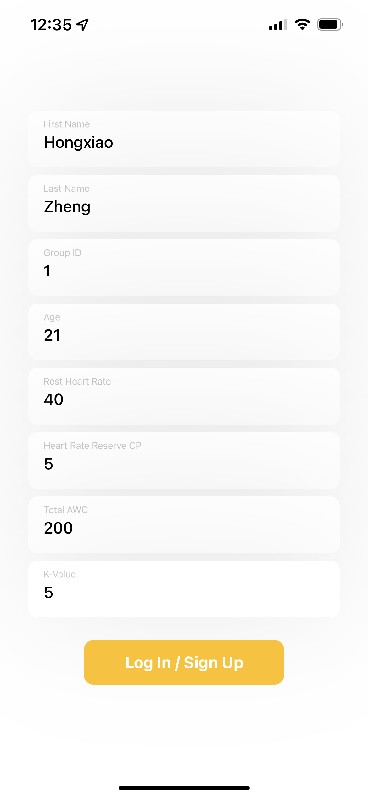

# Wearable-Based Fatigue Monitoring App

This project is associated with [DPM](https://dpm.engin.umich.edu/) lab at UMich, particularly the research on [Wearable Biosensors-based Measurement of Workers’ Physical and Mental Status](https://dpm.engin.umich.edu/research/#:~:text=Wearable%20Biosensors%2Dbased%20Measurement%20of%20Workers%E2%80%99%20Physical%20and%20Mental%20Status). The research focuses on using wearable devices to help assess physical status of constructions workers. This repo builds the iOS app that communicates with  a [E4 wristband](https://www.empatica.com/en-int/research/e4/) to retrieve heart rate data, and connects with a [backend server](https://github.com/Waley-Z/dpm-wearable-backend) for managing user data.

  

## Introduction

This app has the following features.

* Login/logout

  * Note that the user data are stored on disk after the app is inactive, which means user data can be retrieved after the app is killed.
  * After the user enters first and last names, the other data will be filled out automatically if the user is in the database.
  * Group ID specifies the group which the user wants to retrieve co-worker information. Other data are intended for fatigue level calculation.

	

* Connects to/disconnects from E4 wristband, and retrieves inter-beat interval (IBI) and battery level.

* Calculates heart rate using IBI, and finally get the current fatigue level based on the algorithm in the following publication.

  > Lee, G., Lee, S., Brogmus, G. (2023). Feasibility of Wearable Heart Rate Sensing-Based Whole-Body Physical Fatigue Monitoring for Construction Workers. In: , *et al.* Proceedings of the Canadian Society of Civil Engineering Annual Conference 2021. CSCE 2021. Lecture Notes in Civil Engineering, vol 251. Springer, Singapore. https://doi.org/10.1007/978-981-19-1029-6_23

* Connects with server to periodically update fatigue levels of co-workers, presented in a history graph.
* Sends periodic notifications to users to remind them of checking out co-workers' fatigue levels. 

## Resources

* [E4 link SDK for iOS Development](https://developer.empatica.com/ios-sdk-tutorial-100.html)

* [E4 link SDK iOS Class Reference](https://developer.empatica.com/ios-sdk-api-reference-100.html)

* [E4 data - IBI expected signal](https://support.empatica.com/hc/en-us/articles/360030058011)

  > Studies with strong movement (more than 30% of the time): for these, you will probably not be able to get enough reliable IBI to compute heart rate variability continuously. However, you can still compute the average heart rate like consumer devices have done for over a decade. For example, you can use the motion information that our sensor gives, and when it is large, discard the IBI's with huge motion. Then take the average of the remaining IBI and check that they are in a reasonable range that has not changed too abruptly from the last estimate.

* [E4 data - BVP expected signal](https://support.empatica.com/hc/en-us/articles/360029719792-E4-data-BVP-expected-signal)

* [Utilizing the PPG/BVP signal](https://support.empatica.com/hc/en-us/articles/204954639-Utilizing-the-PPG-BVP-signal)

	> (eq 1.) GREEN, RED -->[ Algorithm 1]  --> PPG --> [Algorithm 2] --> IBI
	
* [Interfacing with UIKit — SwiftUI Tutorials - Apple Developer](https://developer.apple.com/tutorials/swiftui/interfacing-with-uikit)

* [Managing model data in your app - Apple Developer](https://developer.apple.com/documentation/swiftui/managing-model-data-in-your-app)

* [Working with UI Controls — SwiftUI Tutorials - Apple Developer](https://developer.apple.com/tutorials/swiftui/working-with-ui-controls)
